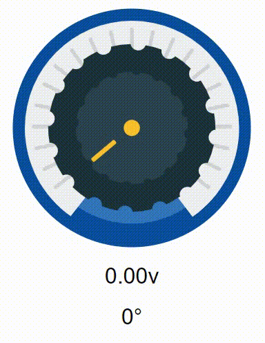

# Rotary Potentiometer - React Component
[](duducmt.github.io/grid-store/) 
[](https://github.com/duduCMT/ReactJS-Rotary-Potentiometer/blob/master/LICENSE) 
[](#) 

## 📸 Preview

<p align="center">
  
</p>

## 📌 Nota importante!
Este componente não possui uma fácil implementação em projetos de terceiros usando gerenciadores de pacotes. **Inicialmente, esse repositório funcionará apenas para portfólio e exposição da ideia.**

## 📝 Descrição

Componente para aplicações ReactJS que simula um [potenciômetro](https://pt.wikipedia.org/wiki/Potenci%C3%B4metro) rotativo virtual. Suporta eventos de mouse e touch até o momento.

## 🚀 Objetivo

Este projeto foi criado com o objetivo de criar um componente reutilizável que simula um potenciômetro rotativo virtual. A ideia inicial é que este component receba dois valores de entrada (um mínimo e um máximo) e ao girar, ele dispare eventos de "onChange" com o valor apontado relativo aos parâmetros de entrada.

## ✅ Features Funcionais
- Interação usando mouse (Rotacionar)
- Evento onChange injetável
- Acesso ao angulo atual 
- Calculo de valor variante

## 🧪 Features em Teste
- Interação usando touch (Rotacionar)

## 👷 Features Futuras
- Interação usando scroll (Rotacionar)
- Personalização de partes do component
- Melhor estruturação do CSS
- Facilitar importação em projetos de terceiros

## 🔎 Amostra de Utilização
```javascript
import { useState } from "react";
import RotaryPotentiometer from "./components/RotaryPotentiometer";

function App() {
  const [tensao, setTensao] = useState(0.0);
  const [angle, setAngle] = useState(0);

  return (
    <div className="container">
      <RotaryPotentiometer
        minValue={0.0}
        maxValue={5.0}
        onChange={(obj) => {
          setTensao(obj.value.toFixed(2))
          setAngle(obj.angle)
        }} />
      <h1>{tensao}v</h1>
      <h1>{angle}°</h1>
    </div>
  );
}

export default App;
````

## 📎 Props
* `minValue` - Valor mínimo que representa a posição inicial do potenciômetro.
* `maxValue` - Valor máximo que representa a posição final do potenciômetro.
* `onChange` - Evento que é chamado sempre que o ângulo do potenciômetro mudar. Retorna um objeto com a seguinte estrutura:
```javascript
//Objeto recebido pelo onChange
obj {
  value: number,
  angle: number,
  realAngle: number
}
```

## ❌ Problemas e Limitações
- O CSS do potenciômetro ainda não está bem definido, por causa disso, o componente pode receber comportamentos estranhos caso não seja bem configurado.
- Existe uma imprecisão na conversão dos valores iniciais (entre 0 e 4 graus) e finais (entre 256 e 260 graus). Esse problema foi corrigido pulando esses valores, ou seja, não é possível receber os graus 1, 2, 3 e 4. Em vez disso, você sempre recebe o valor 0 nesse intervalo. Consequentemente você também não recebe os valores convertidos nesses graus, e sim, um retorno do valor mínimo inserido. O mesmo acontece com os valores finais 256, 257, 258, 259.
  > Esse problema não deve afetar a grande maioria do usuários. Mas vale aqui o registro dessa limitação do componente.

Todos os problemas devem ser corrigidos em features futuras.


